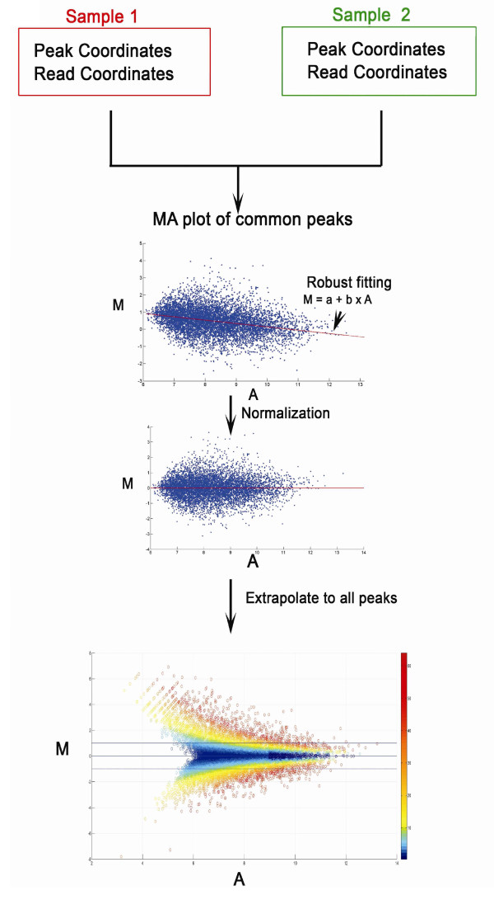

.. _intro:

Introduction
============

**ChIP-Seq** is widely used to characterize genome-wide binding patterns of transcription factors (TFs) and other
chromatin-associated proteins. Although comparison of ChIP-Seq data sets is critical for understanding the role of
their cell type/state-specific binding on modulating gene regulation programs, few quantitative approaches have been
developed.

Here, we present a simple and effective method, **MAnorm**, for quantitative comparison of ChIP-Seq data sets
describing transcription factor binding sites and epigenetic modifications. The quantitative binding differences
inferred by MAnorm showed a strong correlation with both the changes in expression of target genes and the binding
of cell type-specific regulators.

MAnorm uses common peaks of two samples as a reference to build the rescaling model for normalization, which is based
on the empirical assumption that if a chromatin-associated protein has a substantial number of peaks shared in two
conditions, the binding at these common regions will tend to be determined by similar mechanisms, and thus should
exhibit similar global binding intensities across samples.

The normalized *M* value given by MAnorm was used as a **quantitative** measure of **differential binding** in each
peak region between two samples, with peak regions associated with larger absolute *M* values exhibiting greater
binding differences between two samples.

MAnorm exhibited excellent performance in quantitative comparison of ChIP-Seq data sets for both epigenetic
modifications and transcription factors (TFs). The quantitative binding differences inferred by MAnorm were highly
correlated with both the changes in expression of target genes and also the binding of cell type-specific regulators.
With the accumulation of ChIP-seq data sets, MAnorm should serve as a powerful tool for obtaining a more comprehensive
understanding of cell type-specific and cell state-specific regulation during organism development and disease onset.

Model Description
-----------------

Assumptions
^^^^^^^^^^^
- First, we assume the true intensities of most common peaks are the same between two ChIP-Seq samples.
  This assumption is valid when the binding regions represented by the common peaks show a much higher level of
  co-localization between samples than that expected at random, and thus binding at the common peaks should be
  determined by similar mechanisms and exhibit similar global binding intensity between samples.
- Second, the observed differences in sequence read density in common peaks are presumed to reflect the scaling
  relationship of ChIP-Seq signals between two samples, which can thus be applied to all peaks.

Workflow
^^^^^^^^

